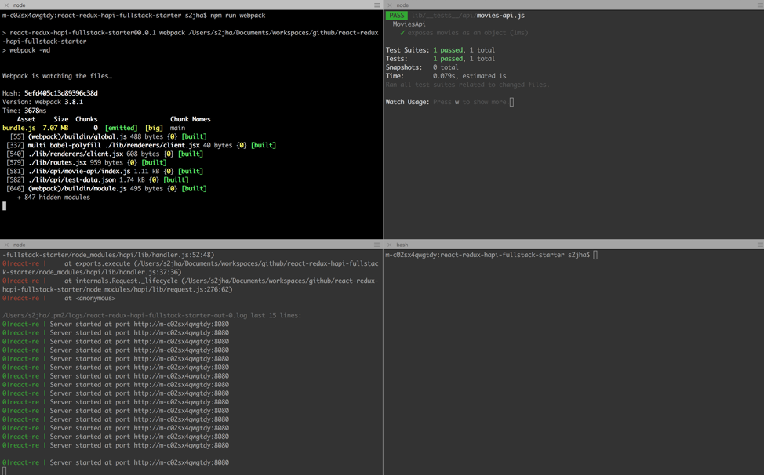

# react-redux-hapi-fullstack-starter

Starter Kit for Data driven production ready react application

###Full-stack React
- Express
- Babel
- Webpack

###Jest for testing
- Snapshot testing
- Mock data

Isomorphic React
- ReactDOMServer


Server side entry point is at server-renderer.jsx
Client side entry point is at client.jsx


### How to run local dev environment
Once code is downloaded (git clone).
Go to the folder and run npm install.
Open 4 terminals for following commands

1. ```npm run webpack```
2. ```npm run start``` once server started run ```npm run logs```
3. ```npm run test```
4. Use this terminal to run any new npm install or git commit/push.




### Webstorm code style configuration to match with eslint of airbnb

[Webstorm code style to import](./docs/airbnb_webstorm_codestyle.xml)
